# Instalação Debian 13 minimal

## 1. Download da ISO

Baixe a ISO `netinst` direto do link:

> [https://cdimage.debian.org/debian-cd/current/amd64/iso-cd/debian-13.6.0-amd64-netinst.iso](https://cdimage.debian.org/debian-cd/current/amd64/iso-cd/debian-13.6.0-amd64-netinst.iso)

Ou baixe a ISO (torrent) do site oficial do Debian:

> [https://www.debian.org/distrib/](https://www.debian.org/distrib/)

Grave um pen drive com Rufus ou Ventoy.

---

## 2. Início da instalação

#### 2.1. Instalação gráfica

Ao dar boot com o pen drive, selecione a opção `Graphic Install`:

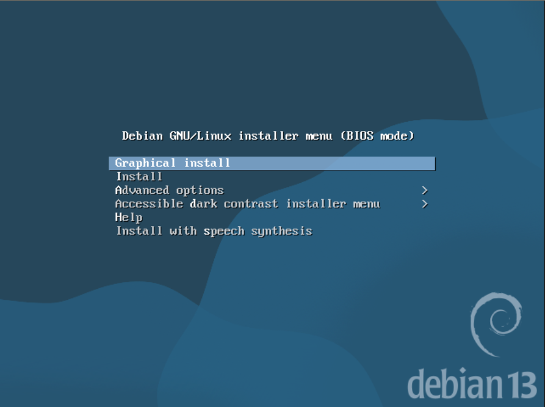

#### 2.2. Idioma

Procure e selecione o idioma `Portuguese (Brazil) - Português do Brasil`:

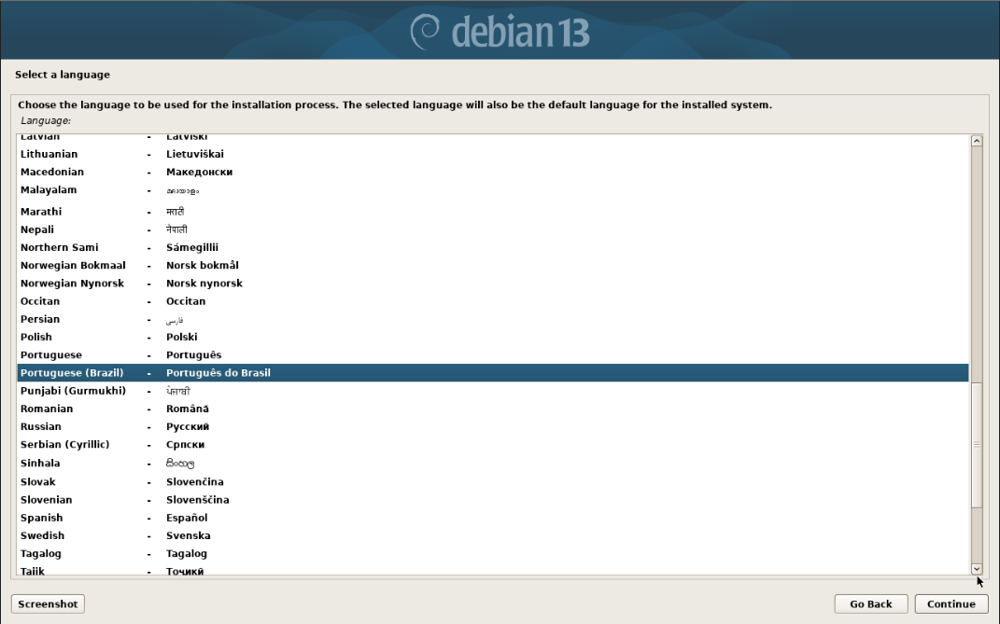

Configure a **Localidade** em `Brasil` e o **layout do teclado** para `Português Brasileiro`

---

### 3. Configuração de rede

O Debian tenta, primeiro, utilizar o DHCP para definir o IP da máquina. Caso não encontre um servidor DHCP na rede, configure o IP manualmente. Selecione a opção `Configurar a rede manualmente` e siga os passos:

> Endereço IP: <IP da máquina>
> Máscara de rede: <máscara da rede>
> Gateway: <gateway da rede>
> Endereço do servidor de nomes: <DNS da rede ou DNS público>

#### 3.1. Nome da máquina

Defina o `hostname` da máquina.

#### 3.2. Domínio

Caso haja um domínio que você queira ingressar o servidor, siga com seu IP. Se não, deixe o campo em branco e continue.

---

### 4. Configurações de usuário

Etapa de configuração de usuários: root e administrator (UID:GID 1000:1000)

#### 4.1. Usuário root

Defina uma **senha forte** para o usuário root:

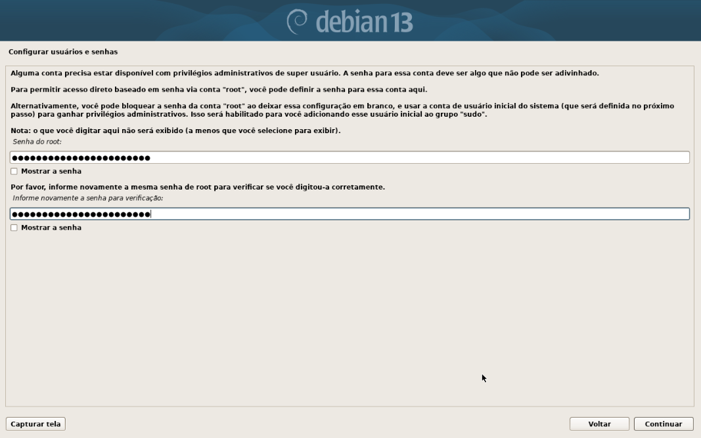

#### 4.2. Usuário Admin

Crie o usuário admin também com uma senha forte, pois ele possui permissões de root com `sudo` (padrão para usuários com UID:GID 1000). Siga o padrão de nome de acordo com o uso, organização, etc.

##### 4.2.1. Nome do usuário

Nome e Sobrenome do usuário

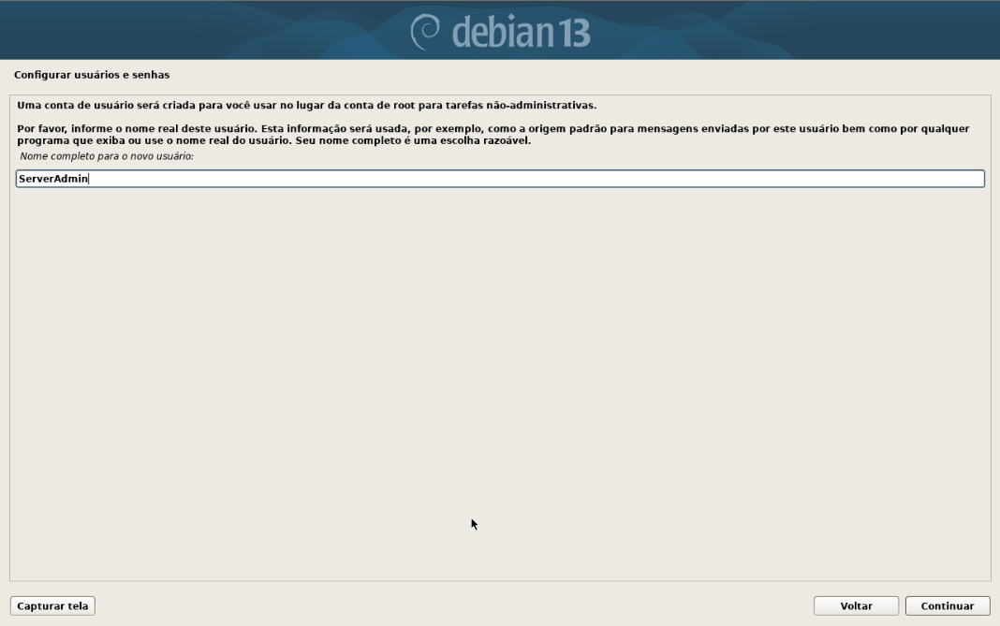

##### 4.2.2. Usuário do linux

Usuário do Linux

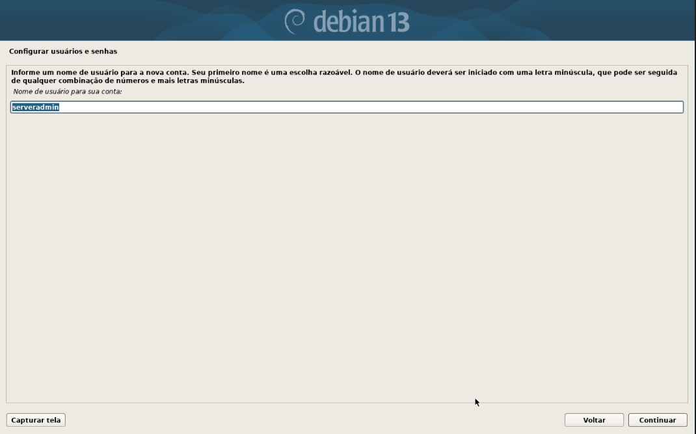

---

## 5. Configuração do relógio

Configure o relógio para `São Paulo`.

---

## 6. Particionamento de discos

Na etapa `Particionar discos` selecione a opção `Manual`

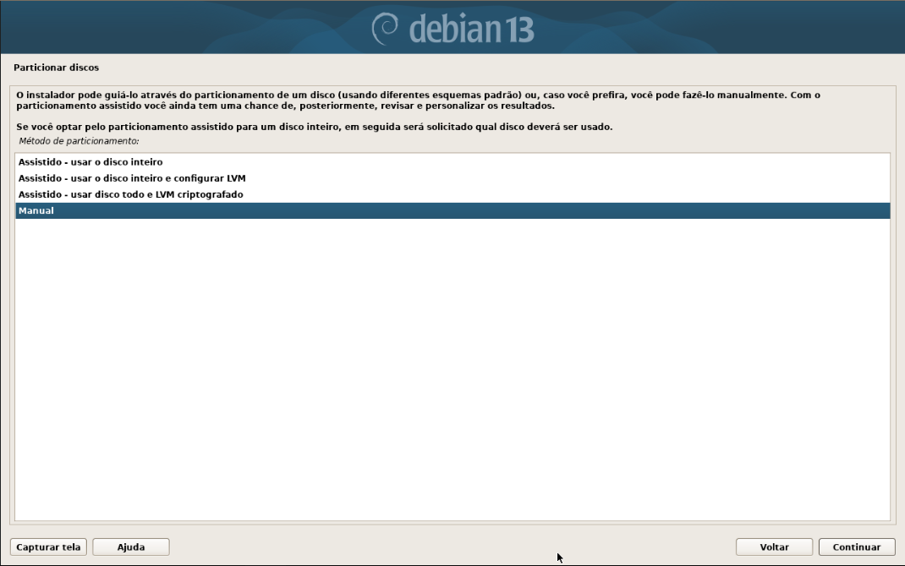

### 6.1. Particionamento manual do disco

Selecione o(s) disco(s) a ser(em) utilizado(s) e crie uma nova tabela de partição.

#### 6.1.1. Partição raiz (/)

Configuração da partição raiz do Linux.

> Selecione a partição disponível -> Criar uma nova partição

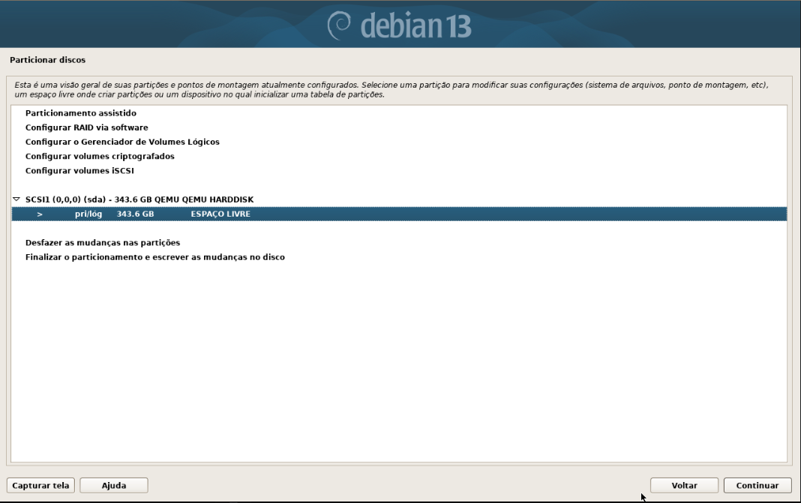

#### 6.1.2. Tamanho da raiz

Para a partição barra/raiz, deixe **50 GB**

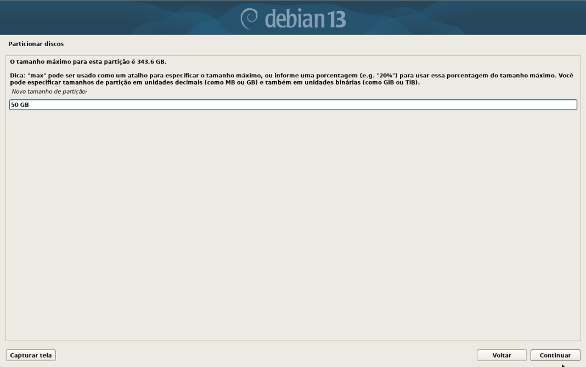

#### 6.1.3. Tipo de partição

Selecione o tipo de partição `Primária`

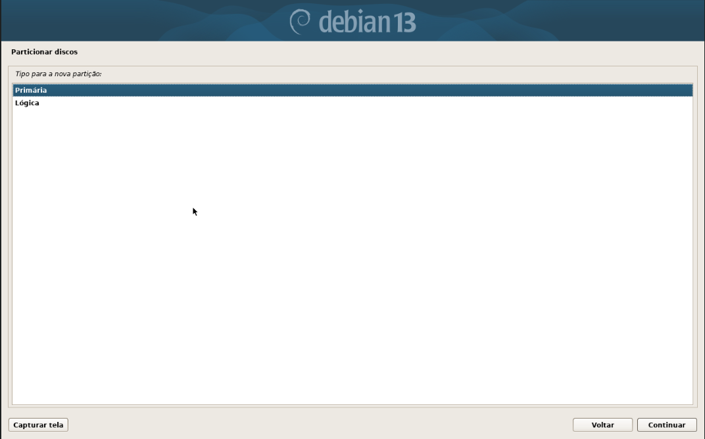

#### 6.1.4. Localização da partição

Para a **localização da nova partição**, selecione `Início`

#### 6.1.5. Configurações da partição

Nesta etapa não é necessário fazer nenhuma alteração, deixa-as padrão. Apenas finalize a configuração da partição.

> Usar como:                         Sistemas de arquivos com "journaling" ext4
>
> 
> Ponto de montagem:                 /
> 
> Opções de montagem:                defaults
> 
> Rótulo:                            nenhum
> 
> Blocos reservados:                 5%
> 
> Uso típico:                        padrão
> 
> Flag inicializável:                desligado

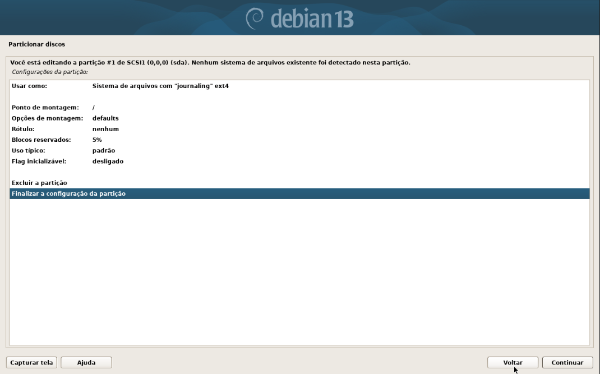

### 6.2. Partição EFI

Se a máquina suportar EFI, crie uma partição de `512 MB` `Primária` e no esquema de particionamento. Em `Usar como` selecione `Partição de sistema EFI` e defina o ponto de montagem em `/boot/efi`.

### 6.3. Partição Swap

Crie uma nova partição `Primária` de `16 GB`. Na opção `Usar como`, defina `Área de troca (swap)`.

### 6.4. Partição de Dados

Por fim, crie uma nova partição `Primária` com `todo o espaço restante`.

Nas configurações, defina o `Ponto de montagem` como `Informar manualmente`. Deixe o ponto de montagem em `/dados`.

> Usar como:                         Sistemas de arquivos com "journaling" ext4
>
> 
> Ponto de montagem:                 /dados
> 
> Opções de montagem:                defaults
> 
> Rótulo:                            nenhum
> 
> Blocos reservados:                 5%
> 
> Uso típico:                        padrão
> 
> Flag inicializável:                desligado

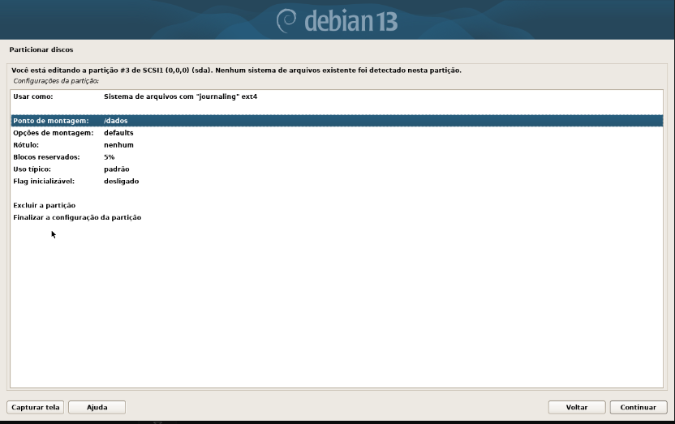

### 6.5. Finalizar particionamento

Após todo o particionamento, clique em `Finalizar o particionamento e escrever as mudanças no disco`. Confirme as mudanças na página seguinte.

Ao avançar, o instalador irá iniciar automaticamente a instalação do `Sistema Base`.

---

### 7. Configuração do gerenciador de pacotes

Não será utilizada nenhuma `mídia de instalação adicional`, basta prosseguir com a opção em `Não`nesta etapa.

Na próxima página, selecione `Brasil` como país do espelho.

No `espelho do reposotório`, selecione o padrão do debian `deb.debian.org`

Na última etapa, configure um Proxy de rede, caso você tenha um em sua rede. Se não, deixe em branco e continue.

Na próxima etapa, `Não` participe do `Concurso de utilização de pacotes`.

---

### 8. Seleção de pacotes de software

Deixe marcadas **apenas** as opções:

> servidor SSH
> 
> utilitários de sistema padrão

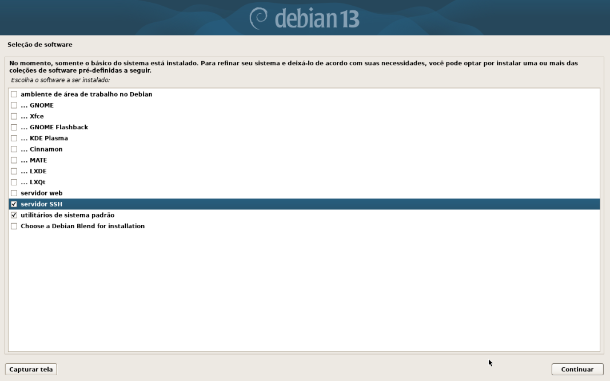

---

### 9. GRUB

Caso o instalador peça para instalar um inicializador GRUB (inicializador do Linux), selecione `Sim` e depois selecione o **disco físico** onde ficará o GRUB. Por exemplo, se a instalação foi feita em `/dev/sda`, selecione-o.

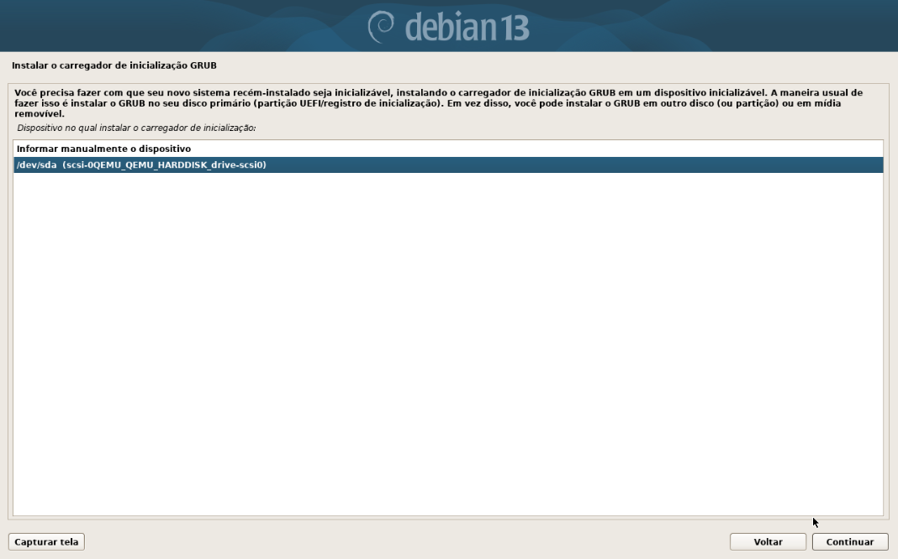

---

### 10. Fim

Após concluir, reinicie a máquina.